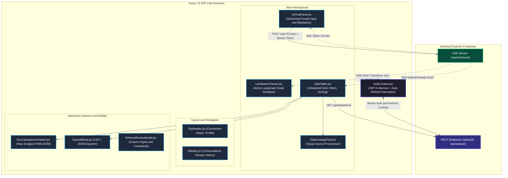
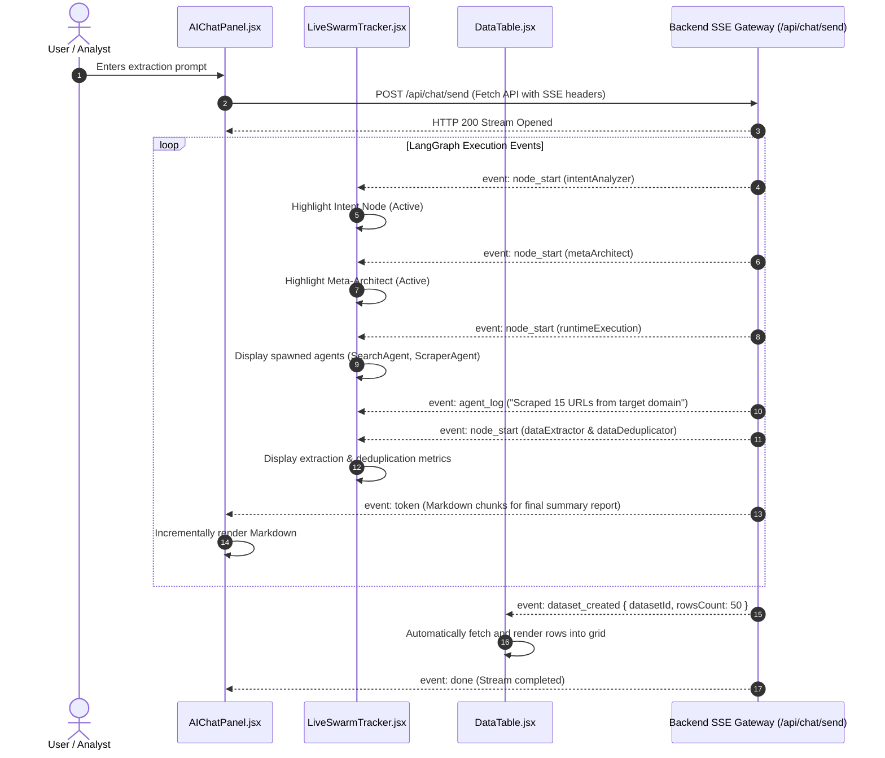

# Autonomous Agentic Data Engineering & Swarm Intelligence Platform (Frontend)

A modern, high-performance web interface built with **React 19**, **Vite**, **Tailwind CSS**, and **Lucide Icons** for interacting with autonomous multi-agent data engineering swarms in real time.

The frontend visualizes live agent reasoning, active LangGraph execution nodes, interactive virtualized dataset tables, and provenance lineage DAGs powered by Server-Sent Events (SSE).

> 📄 **Complete Architecture Specification**: See [SYSTEM_ARCHITECTURE.md](./SYSTEM_ARCHITECTURE.md) or [docs/SYSTEM_ARCHITECTURE.md](./docs/SYSTEM_ARCHITECTURE.md) for full 17-section technical documentation.

---

## 1. System Architecture Overview

The frontend connects directly to the Express 5 backend API gateway via standard REST endpoints and an asynchronous Server-Sent Events (SSE) telemetry stream.



---

## 2. Real-Time Telemetry & SSE Flow

When a user submits a prompt, `AIChatPanel.jsx` opens an event stream with the backend to receive live telemetry from the LangGraph multi-agent execution pipeline.



---

## 3. Key Frontend Components (`src/components/`)

| Component | Primary Purpose | Key Features |
| :--- | :--- | :--- |
| **`AIChatPanel.jsx`** | Main conversational prompt interface | Live SSE token rendering, prompt templates, markdown code block formatting, action buttons. |
| **`LiveSwarmTracker.jsx`** | Real-time agentic execution graph | Displays active LangGraph nodes (`intentAnalyzer`, `metaArchitect`, `runtimeExecution`, `dataExtractor`, `dataDeduplicator`), active agent roles, and live tool thoughts. |
| **`DataTable.jsx`** | Extracted dataset tabular viewer | Multi-column sorting, case-insensitive substring search, pagination, row selection, CSV/JSON export trigger. |
| **`DataLineageFlow.jsx`** | Data provenance visualizer | Shows visual DAG linking extracted records back to original target URLs, scraping tools, and agent execution times. |
| **`SchemaReviewModal.jsx`** | Schema inspection & validation | Column type inference review (string, number, boolean, date), nullable flags, and rename capabilities. |
| **`ExportModal.jsx`** | File export utility | Instant RFC-4180 CSV generation and formatted JSON download. |
| **`SourceInspectorDrawer.jsx`**| Raw data auditor | Slide-over drawer displaying raw HTML snippets, scraped DOM nodes, and HTTP header metadata. |
| **`PromptStudio.jsx`** | Prompt experimentation | Pre-configured prompts, agent role configuration, and extraction templates. |
| **`GovernanceView.jsx`** | Swarm audit dashboard | Overview of token usage, model distribution, rate limit events, and system uptime. |
| **`TopHeader.jsx`** | Global header | Workspace breadcrumbs, live backend connectivity badge, user profile menu. |
| **`Sidebar.jsx`** | Navigation drawer | Conversation threads, pinned sessions, new chat trigger, dataset manager links. |

---

## 4. State Management & API Integration

### Authentication Context (`src/context/AuthContext.jsx`)
- Stores user identity, email, role, and current short-lived Access Token in application memory.
- Manages login, registration, email OTP verification, and logout lifecycle.

### API Client Service (`src/services/api.js`)
- Configured Axios instance targeting `VITE_API_URL` (default: `http://localhost:5000/api`).
- **Request Interceptor**: Automatically attaches `Authorization: Bearer <accessToken>` to protected routes.
- **Response Interceptor**: Intercepts `401 Unauthorized` responses and automatically invokes `/api/auth/refresh-token` to silently renew access tokens using HTTP-only cookies without interrupting user work.

---

## 5. Directory Structure

```text
src/
├── assets/              # Static SVG and PNG icons/graphics
├── components/          # Modular React UI components
│   ├── AIChatPanel.jsx           # Real-time SSE chat panel
│   ├── DataLineageFlow.jsx       # Provenance DAG visualizer
│   ├── DataTable.jsx             # Virtualized data table
│   ├── ExportModal.jsx           # CSV/JSON export dialog
│   ├── GovernanceView.jsx        # Audit & token telemetry
│   ├── HistoryView.jsx           # Task run history
│   ├── LiveSwarmTracker.jsx      # Agent swarm node visualizer
│   ├── OverviewStats.jsx         # Analytics overview cards
│   ├── PromptStudio.jsx          # Prompt crafting playground
│   ├── ResearchReportModal.jsx   # Detailed report viewer
│   ├── SchemaReviewModal.jsx     # Schema editor modal
│   ├── Sidebar.jsx               # Navigation & conversation history
│   ├── SourceInspectorDrawer.jsx # Scraped DOM inspector
│   └── TopHeader.jsx             # Top bar & status indicators
├── context/
│   └── AuthContext.jsx           # User state & JWT management
├── data/
│   ├── mockData.js               # Demonstration dataset seeds
│   └── promptTemplates.js        # Built-in extraction templates
├── services/
│   └── api.js                    # Axios instance with interceptors
├── App.css              # Custom styling & animations
├── App.jsx              # Main layout, view switching & routing
├── index.css            # Tailwind directives & theme tokens
└── main.jsx             # React 19 application entry point
```

---

## 6. Installation & Development

### Prerequisites
- Node.js >= 20.x
- Backend API running on `http://localhost:5000`

### Setup Steps
1. **Install dependencies**:
   ```bash
   npm install
   ```

2. **Configure environment**:
   Create a `.env` file in the root folder:
   ```env
   VITE_API_URL=http://localhost:5000/api
   ```

3. **Start development server**:
   ```bash
   npm run dev
   ```

4. **Build for production**:
   ```bash
   npm run build
   ```
